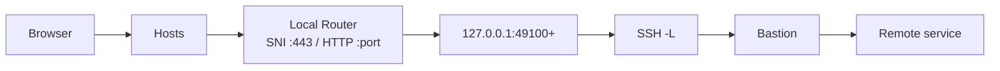

# Kiến trúc

## Mục đích

Tunnelo giúp developer truy cập dịch vụ nội bộ (GitLab, Jira, API…) qua **SSH bastion** mà không cần VPN hay reverse tunnel.

## Stack

| Layer | Công nghệ |
|---|---|
| Shell | Tauri 2 (Rust + WebView) |
| UI | React 18 + TypeScript (Vite) |
| SSH | `russh` 0.54 (in-process, không gọi `ssh.exe`) |
| Secrets | `keyring` 3 (`windows-native`) |
| Profile | JSON atomic write trong app-data |
| IPC | Tauri `invoke()` + `emit()` / `listen()` |

## Luồng khi Start tunnel

```
React (start_tunnel)
  → commands.rs
  → TunnelManager::start
  → LocalRouter::activate_tunnel   (hosts + router + port pool)
  → supervise (loop reconnect)
      → resolve_bastion_host       (wildcard scan nếu cần)
      → connect_session (russh)
      → spawn_local_forward × N    (TcpListener + channel_open_direct_tcpip)
  → emit tunnel://state / tunnel://log
```

## AppState (shared)

```rust
pub struct AppState {
    pub store: Arc<ProfileStore>,      // tunnels.json
    pub tunnels: TunnelManager,        // SSH sessions đang chạy
    pub local_router: LocalRouter,     // hosts + SNI/HTTP routers
}
```

Khởi tạo trong `lib.rs::setup`: load store, init host keys, cleanup hosts orphan, auto-start profiles có `autoStart`.

## Nguyên tắc thiết kế

1. **Một SSH, nhiều forward** — giống `ssh -L ... -L ... user@bastion`.
2. **Chỉ `-L`** — không Caddy, không `-R`, không thay đổi server.
3. **Router cục bộ** — hostname trỏ `127.0.0.1`, SNI/Host header chọn backend port.
4. **Secrets ngoài JSON** — keyring OS cho password/passphrase.
5. **TOFU host key** — fingerprint lưu `host_keys.json`.
6. **Tray** — đóng cửa sổ không dừng tunnel.

## Source chính

| File | Vai trò |
|---|---|
| `src-tauri/src/lib.rs` | Entry, tray, AppState |
| `src-tauri/src/tunnel.rs` | SSH engine |
| `src-tauri/src/local_router.rs` | Orchestrator routing |
| `src-tauri/src/commands.rs` | IPC commands |
| `src-tauri/src/model.rs` | Data model |
| `src/App.tsx` | UI chính |

## Sơ đồ


